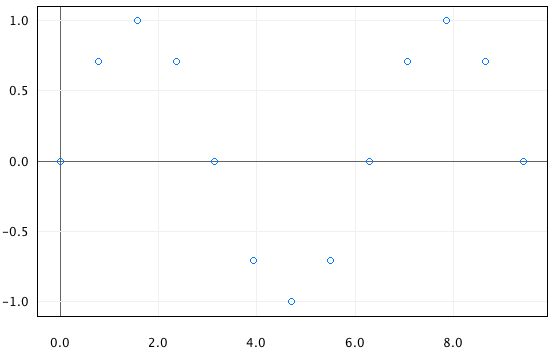

# plot-1d


Generates scatter plots from formatted text files.

## Usage
The shell script plot-1d.sh launches the application.

```cd ./plot-1d
./plot-1d.sh <data.1d>
```

The input data file should contain two columns of numbers separated by a space. The first column gives x-axis values and the second column gives the corresponding y-axis value. For example a file containing the following represents a few data points on the line `y = 2x + 1` for the x values 0, 1, 2, 3, 4.

```0 1
1 3
2 5
3 7
4 9
```

You can find some example input files under ./test/data.

```
# Plots a sine function
./plot-1d.sh ./test/data/sine.1d 

# Plots a square wave
./plot-1d.sh ./test/data/square_wave.1d

# Plots the price of diamonds versus mass for a sample of 50,000 diamonds
# x: price of diamond in US dollars
# y: mass in carats
./plot-1d.sh ./test/data/diamonds.1d

# Plots Francis Galton's data on the heights of parents and their children (Galton 1886)
# x: child height in inches
# y: average of parents height in inches
./plot-1d.sh ./test/data/galton.1d
```

## Requirements
This program was devoloped using Java 7 and make.

## Licence
Copyright 2015 Michael Stockman

This program is provided under the MIT License. You are generally free to use plot-1d for anything you find useful. See LICENSE for details.
