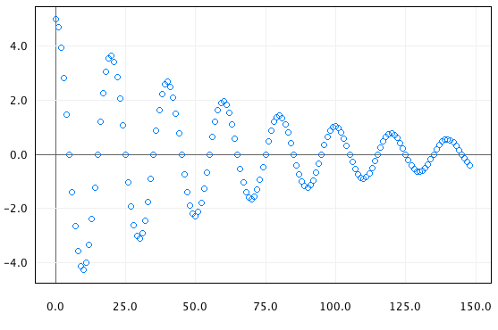

# plot-1d


This program generates plots of time series data. It can also plot other univariate (one-dimensional) functions and function-like pairs of values. Input data is provided in formatted text files with space-delimited columns of numbers.

## Usage
Launch the application using the shell script `plot-1d.sh`. This script takes a single text file as input.

```
cd ./plot-1d
./plot-1d.sh <data.1d>
```

The input data file must contain two columns of numbers separated by a space. The first column gives x-axis values and the second column gives the corresponding y-axis value. For example a text file containing the following represents some data points on the line `y = 2x + 1` for the x values equal to {0, 1, 2, 3, 4}.

```
0 1
1 3
2 5
3 7
4 9
```

## Example Input Data

You can find some sample input files in the subdirectory `./test/data`.

```
# Plots a damped harmonic oscillator over time
./plot-1d.sh ./test/data/damped_harmonic_oscillator.1d

# Plots a square wave
./plot-1d.sh ./test/data/square_wave.1d

# Plots the population of the Bronx by year
# x: Year
# y: Population of Bronx County, New York
./plot-1d.sh ./test/data/population_bronx.1d

# Plots the concentration of CO2 in Earth's atmosphere (estimated world wide mean) by year
# x: Year (negative values indicate BC)
# y: Atomospheric Carbon Dioxide concentration in ppm
./plot-1d.sh ./test/data/atmospheric_C02_ppm.1d
```

## Requirements
To run this program you will need Java 7 JRE or later. To develop this project you will need Java 7 JDK as well as the program make.

## Licence
Copyright 2015 Michael Stockman

This program is provided under the MIT License, so you are pretty much free to use plot-1d for anything you find useful. See LICENSE file for details.
